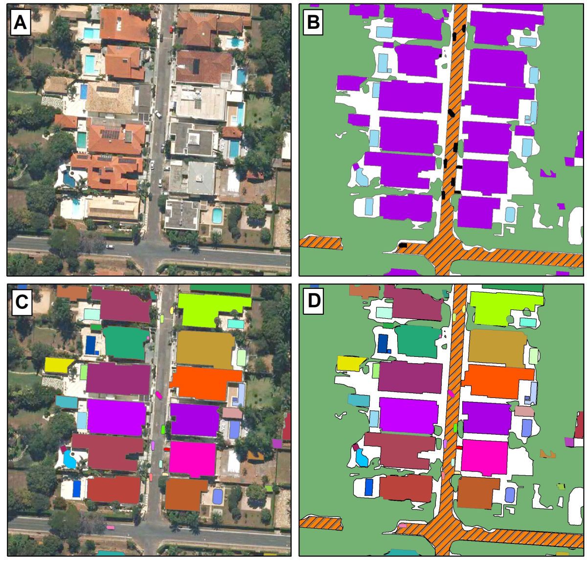
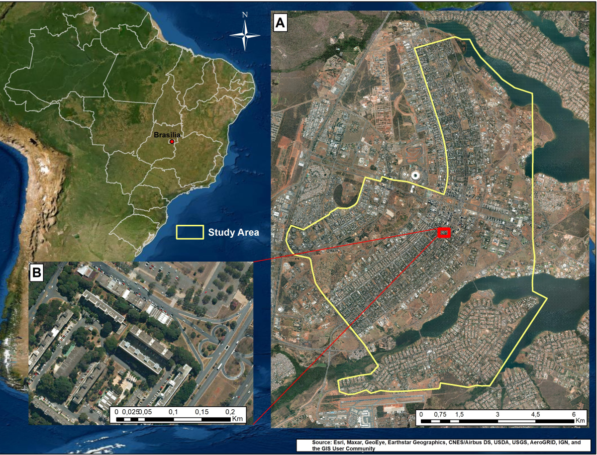
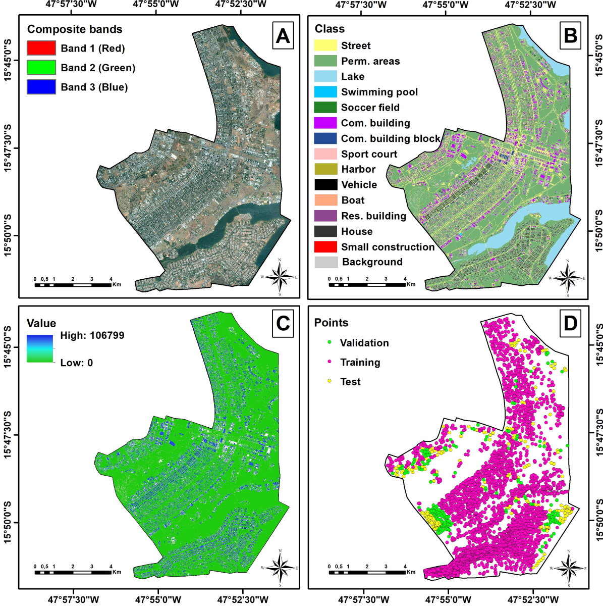
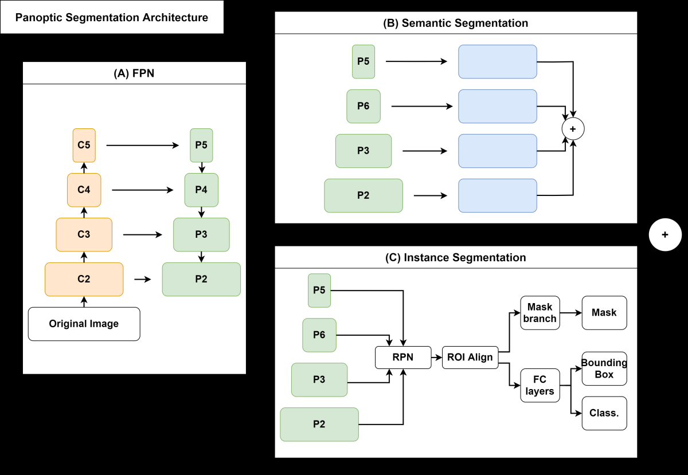
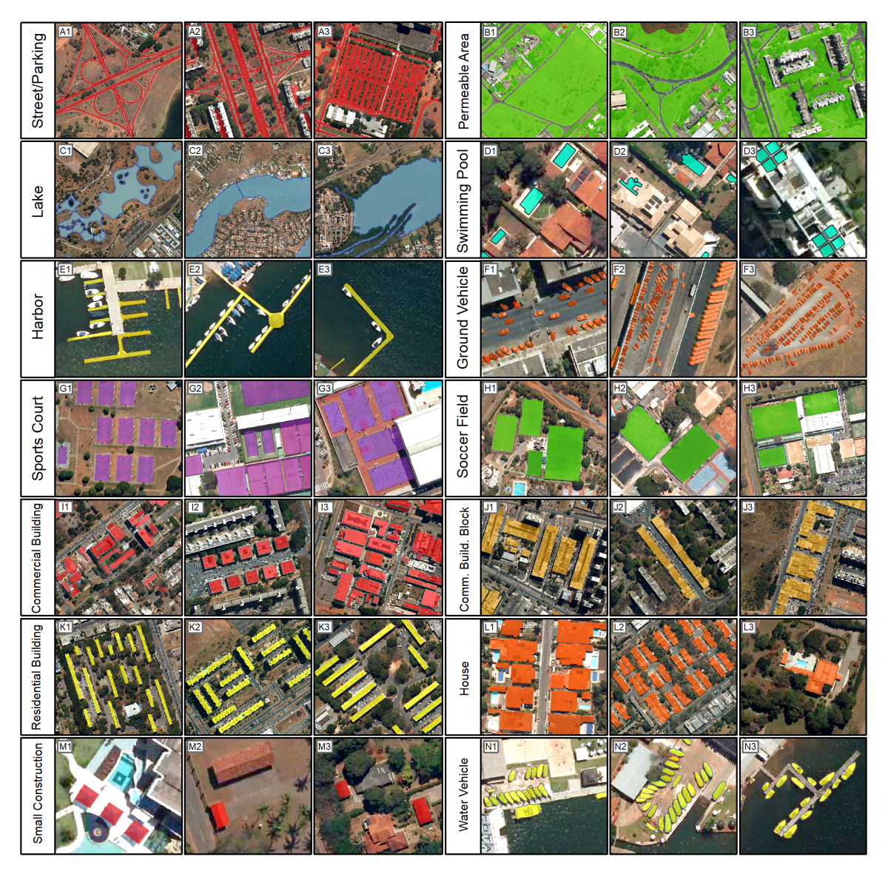

# BSB Aerial Dataset

A panoptic segmentation dataset of aerial imagery from Brasilia, Brazil, introduced in the paper **"Panoptic Segmentation Meets Remote Sensing"** published in *Remote Sensing* (MDPI), 2022.

> **Panoptic segmentation** combines semantic and instance segmentation, allowing the simultaneous detection of amorphous regions ("stuff") and countable objects ("things") in a single unified output.

<p align="center">
  
</p>
<p align="center"><em>Example tile from the BSB Aerial Dataset. (A) Original aerial image, (B) Semantic segmentation, (C) Instance segmentation, (D) Panoptic segmentation.</em></p>

---

## Download

The dataset is publicly available on Hugging Face:

**[Download BSB Aerial Dataset](https://huggingface.co/datasets/osmarluiz/BSB-Aerial-Dataset)**

---

## Paper

**Panoptic Segmentation Meets Remote Sensing**

Osmar L. F. de Carvalho, Osmar A. de Carvalho Junior, Cristiano R. e Silva, Anesmar O. de Albuquerque, Nickolas C. Santana, Dibio L. Borges, Roberto A. T. Gomes, Renato F. Guimaraes

*Remote Sensing*, vol. 14, no. 4, p. 965, 2022

[[Paper (Open Access)]](https://www.mdpi.com/2072-4292/14/4/965) | [[ArXiv]](https://arxiv.org/abs/2111.12126) | [[DOI: 10.3390/rs14040965]](https://doi.org/10.3390/rs14040965)

### Abstract

Panoptic segmentation combines instance and semantic predictions, allowing the detection of "things" and "stuff" simultaneously. Effectively approaching panoptic segmentation in remotely sensed data can be promising in many challenging problems since it allows continuous mapping and specific target counting. Several difficulties have prevented the growth of this task in remote sensing: (a) most algorithms are designed for traditional images, (b) image labelling must encompass "things" and "stuff" classes, and (c) the annotation format is complex. Thus, aiming to solve and increase the operability of panoptic segmentation in remote sensing, this study has five objectives: (1) create a novel data preparation pipeline for panoptic segmentation, (2) propose an annotation conversion software to generate panoptic annotations, (3) propose a novel dataset on urban areas, (4) modify Detectron2 for the task, and (5) evaluate difficulties of this task in the urban setting.

---

## Study Area

The dataset was built from high-resolution aerial imagery (0.24 m spatial resolution) covering an urban area in Brasilia, the capital of Brazil.

<p align="center">
  
</p>
<p align="center"><em>(A) Location of the study area in Brasilia, Brazil. (B) Detail of the aerial imagery at 0.24 m resolution.</em></p>

---

## Dataset Overview

<p align="center">
  
</p>
<p align="center"><em>(A) RGB composite of the aerial image, (B) Semantic class map with 14 categories, (C) Sequential instance labeling, (D) Sampling points for train/validation/test splits.</em></p>

|  | Details |
|---|---|
| **Spatial resolution** | 0.24 m |
| **Tile size** | 512 x 512 pixels |
| **Total tiles** | 3,400 |
| **Train / Val / Test** | 3,000 / 200 / 200 |
| **Annotation format** | COCO Panoptic |
| **Image format** | TIFF |

### Classes

The dataset contains **14 classes** divided into stuff (amorphous regions) and things (countable instances):

| ID | Class | Type |
|----|-------|------|
| 1 | Street | Stuff |
| 2 | Permeable Area | Stuff |
| 3 | Lake | Stuff |
| 4 | Swimming Pool | Thing |
| 5 | Harbor | Thing |
| 6 | Vehicle | Thing |
| 7 | Boat | Thing |
| 8 | Sports Court | Thing |
| 9 | Soccer Field | Thing |
| 10 | Commercial Building | Thing |
| 11 | Commercial Building Block | Thing |
| 12 | Residential Building | Thing |
| 13 | House | Thing |
| 14 | Small Construction | Thing |

### Dataset Structure

```
bsb_dataset/
├── annotations/
│   ├── panoptic_train.json
│   ├── panoptic_val.json
│   ├── panoptic_test.json
│   ├── instance_train.json
│   ├── instance_val.json
│   └── instance_test.json
├── image_{train,val,test}/        # RGB aerial tiles (TIFF)
├── panoptic_{train,val,test}/     # Panoptic masks (PNG)
├── panoptic_stuff_{train,val,test}/ # Stuff-only masks (PNG)
└── class_{train,val,test}/        # Semantic masks (PNG)
```

---

## Architecture

We used [Detectron2](https://github.com/facebookresearch/detectron2)'s **Panoptic-FPN** architecture with ResNet-50 and ResNet-101 backbones. The model jointly produces semantic segmentation (stuff) and instance segmentation (things), which are merged into a unified panoptic output.

<p align="center">
  
</p>
<p align="center"><em>Panoptic-FPN architecture: (A) Feature Pyramid Network backbone, (B) Semantic segmentation branch, (C) Instance segmentation branch. The two branches are combined to produce the final panoptic prediction.</em></p>

---

## Results

### Overall Performance

| Backbone | mIoU | Box AP | PQ |
|----------|------|--------|----|
| ResNet-50 | — | — | — |
| **ResNet-101** | **93.9** | **47.7** | **64.9** |

- **mIoU** (mean Intersection over Union) — semantic segmentation quality
- **Box AP** (Average Precision) — instance detection quality
- **PQ** (Panoptic Quality) — unified panoptic metric combining recognition and segmentation

### Per-Class Results

<p align="center">
  
</p>
<p align="center"><em>Panoptic segmentation predictions for each of the 14 classes. Each row shows examples of a specific class with the model's prediction overlaid.</em></p>

---

## Usage with Detectron2

See the example notebook [`Panoptic BSB-Example.ipynb`](Panoptic%20BSB-Example.ipynb) for a complete implementation including dataset registration, training, and inference.

> **Note:** This repository includes a modified `detection_utils.py` that properly handles RGB image tiles in TIFF format. Replace the original Detectron2 file with the provided version.

---

## Panoptic Generator v2

This repository includes the **Panoptic Generator v2** ([`panoptic-generator/`](panoptic-generator/)), a complete rewrite of the original [C++ tool](https://github.com/abilius-app/Panoptic-Generator) in Python. It allows you to build your own remote sensing segmentation datasets from georeferenced imagery.

### Features

- **GUI + CLI** — desktop application (PyQt5) or command-line for automation
- **Simplified input** — just an image + annotation shapefile (or pre-rasterized masks for legacy workflows)
- **Multiple output formats** — COCO Panoptic, COCO Instance, YOLO, Pascal VOC
- **Streaming pipeline** — constant memory usage regardless of dataset size
- **Spatial indexing** — fast geometry lookup with R-tree
- **Auto-detect categories** — reads class columns from shapefiles (numeric or text)
- **Cross-platform** — runs on Windows, Linux, and macOS

### Quick Start

```bash
cd panoptic-generator
pip install -r requirements.txt

# Launch GUI
python main.py

# Or use CLI
python main.py generate --image image.tif --annotation-shapefile labels.shp --output-dir ./dataset
```

See the [original C++ version](https://github.com/abilius-app/Panoptic-Generator) for the GIS-based annotation workflow described in the paper.

---

## Citation

If you use this dataset or the annotation tools in your research, please cite:

```bibtex
@article{decarvalho2022panoptic,
  title={Panoptic Segmentation Meets Remote Sensing},
  author={de Carvalho, Osmar Luiz Ferreira and de Carvalho Junior, Osmar Abilio and e Silva, Cristiano Rosa and de Albuquerque, Anesmar Olino and Santana, Nickolas Castro and Borges, Dibio Leandro and Gomes, Roberto Arnaldo Trancoso and Guimaraes, Renato Fontes},
  journal={Remote Sensing},
  volume={14},
  number={4},
  pages={965},
  year={2022},
  publisher={MDPI},
  doi={10.3390/rs14040965}
}
```

---

## License

This project is licensed under [CC BY 4.0](LICENSE).

## Contact

For questions, reach out at **osmarcarvalho@ieee.org**.
